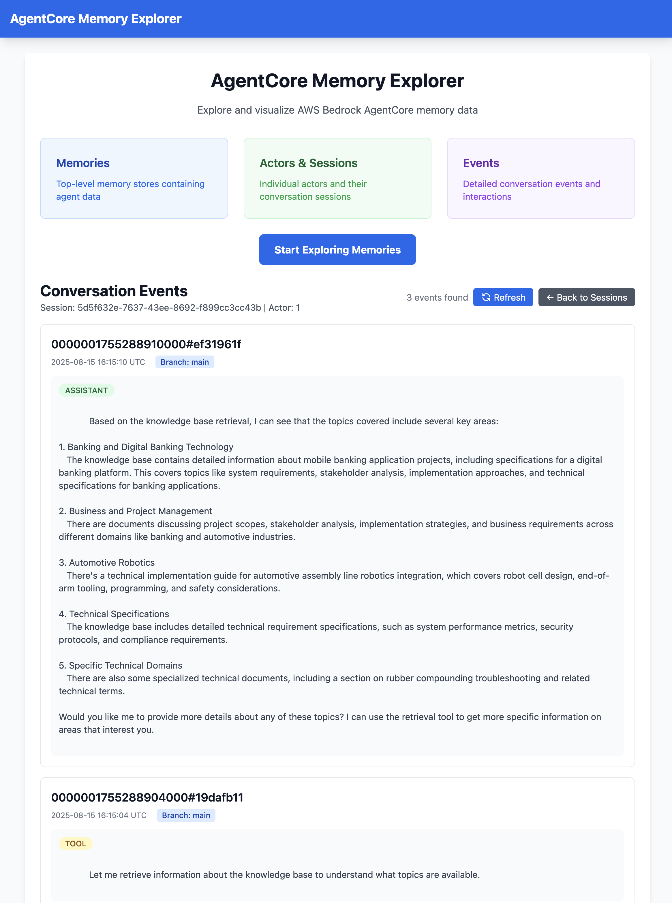

# AgentCore Memory Explorer

A modern web UI for exploring and visualizing AWS Bedrock AgentCore memory data. Built with Flask and HTMX for a responsive, interactive experience.

## Features

- **Memory Store Explorer**: Browse all available memory stores in your AWS account
- **Actor Management**: View actors within each memory store
- **Session Tracking**: Explore conversation sessions for each actor
- **Event Visualization**: Detailed view of conversation events with payload data
- **Real-time Navigation**: Smooth HTMX-powered interface with no page reloads
- **Responsive Design**: Clean, modern UI built with Tailwind CSS



## Architecture

The application provides a hierarchical view of AgentCore memory data:

```
Memories (Control Plane)
├── Actors (Data Plane)
    ├── Sessions (Data Plane)
        └── Events (Data Plane)
```

## Prerequisites

- Python 3.13.1 (specified in .tool-versions)
- AWS credentials configured (via AWS CLI, environment variables, or IAM roles)
- Access to AWS Bedrock AgentCore services

## Quick Start

1. **Initialize the project**:

   ```bash
   make init
   ```

2. **Install dependencies**:

   ```bash
   make install
   ```

3. **Configure AWS credentials** (if not already done):

   ```bash
   aws configure
   ```

4. **Start the application**:

   ```bash
   make start
   ```

5. **Open your browser** and navigate to `http://localhost:5000`

## AWS Permissions Required

Your AWS credentials need the following permissions:

### Control Plane (bedrock-agentcore-control)

- `bedrock-agentcore-control:ListMemories`
- `bedrock-agentcore-control:GetMemory`

### Data Plane (bedrock-agentcore)

- `genesismemory:ListActors`
- `genesismemory:ListSessions`
- `genesismemory:ListEvents`
- `genesismemory:GetEvent`

## Usage

### Navigation Flow

1. **Start at Memories**: View all available memory stores
2. **Select a Memory**: Click "View Actors" to see actors in that memory store
3. **Choose an Actor**: Click "View Sessions" to see conversation sessions
4. **Pick a Session**: Click "View Events" to see detailed conversation events
5. **Explore Events**: View conversation payloads, timestamps, and metadata

### Keyboard Shortcuts

- `r` - Refresh current view
- `h` - Return to home page

### API Endpoints

The application also provides REST API endpoints:

- `GET /health` - Health check
- `GET /api/memory/{id}/details` - Get detailed memory information
- `GET /api/memory/{memory_id}/actor/{actor_id}/session/{session_id}/event/{event_id}` - Get event details

## Development

### Project Structure

```
agentcore-memory-viewer/
├── app.py              # Flask application
├── main.py             # Application entry point
├── log.py              # JSON logging utilities
├── templates/          # Jinja2 templates
│   ├── base.html       # Base template
│   ├── index.html      # Home page
│   ├── memories.html   # Memory list view
│   ├── actors.html     # Actor list view
│   ├── sessions.html   # Session list view
│   ├── events.html     # Event list view
│   └── error.html      # Error page
├── static/             # Static assets
│   └── app.js          # Client-side JavaScript
└── requirements.txt    # Python dependencies
```

### Adding Dependencies

```bash
make install <package_name>
```

This automatically updates both `requirements.txt` and `piplock.txt`.

### Docker Support

Build and run with Docker:

```bash
docker build -t agentcore-memory-viewer .
docker run -p 5000:5000 agentcore-memory-viewer
```

## Technology Stack

- **Backend**: Flask (Python web framework)
- **Frontend**: HTMX (dynamic HTML) + Tailwind CSS (styling)
- **AWS Integration**: boto3 (AWS SDK for Python)
- **Logging**: Custom JSON logging utilities

## Troubleshooting

### Common Issues

1. **AWS Credentials Not Found**

   - Ensure AWS credentials are configured: `aws configure`
   - Check environment variables: `AWS_ACCESS_KEY_ID`, `AWS_SECRET_ACCESS_KEY`

2. **Permission Denied Errors**

   - Verify your AWS user/role has the required AgentCore permissions
   - Check the AWS region is correct for your AgentCore resources

3. **No Memories Found**
   - Ensure you have created memory stores in AWS Bedrock AgentCore
   - Verify you're in the correct AWS region

### Debug Mode

The application runs in debug mode by default during development. Check the console output for detailed error messages and API call logs.

## Contributing

1. Follow the existing code style and structure
2. Add appropriate logging for new features
3. Update templates to maintain consistent UI/UX
4. Test with real AWS AgentCore data when possible

## License

MIT
